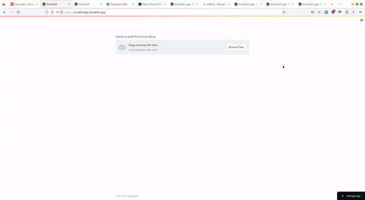

# Welcome to the Orcas Bridge Project

This project is dedicated to the analysis of Orcas’ vocalizations

## Demo

Here's a brief demo:

## Web Application

Click on the image below to access the web application:

## Jupyter Notebook

A Jupyter notebook is also available. [Download the notebook here](https://github.com/MachineLearning-Together/orcas/blob/main/orcas.ipynb)

## Open in Colab
You can also open the notebook in Colab, modify it, and then save it back to GitHub. [Open in Colab](https://colab.research.google.com/github/MachineLearning-Together/orcas/blob/main/orcas.ipynb). To save the file, go to 'File', select 'Save a copy in GitHub', click on the checkbox to include a link, and then click 'OK'.

## Open in JupyterLab
[Open in Jupyter Notebook](YOUR_NOTEBOOK_URL)

